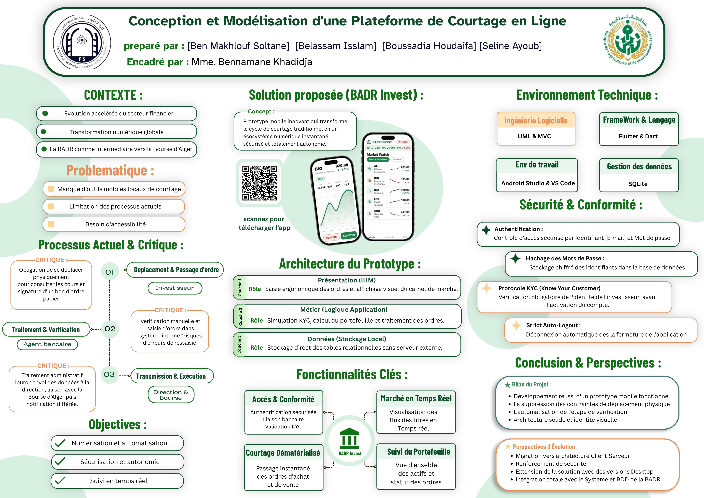
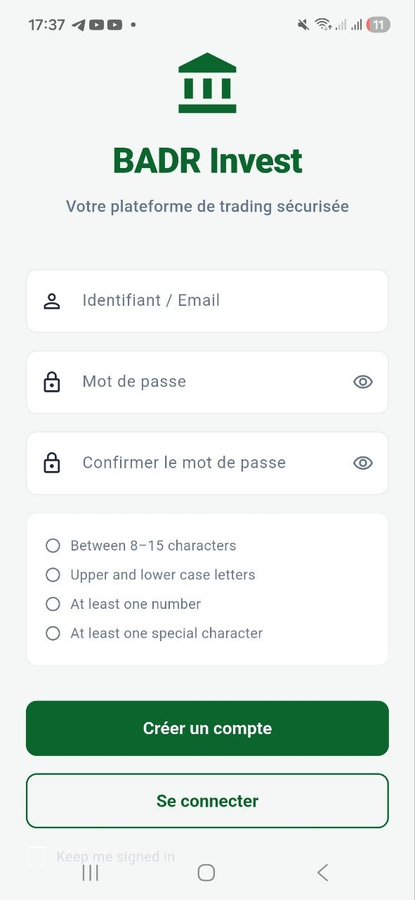
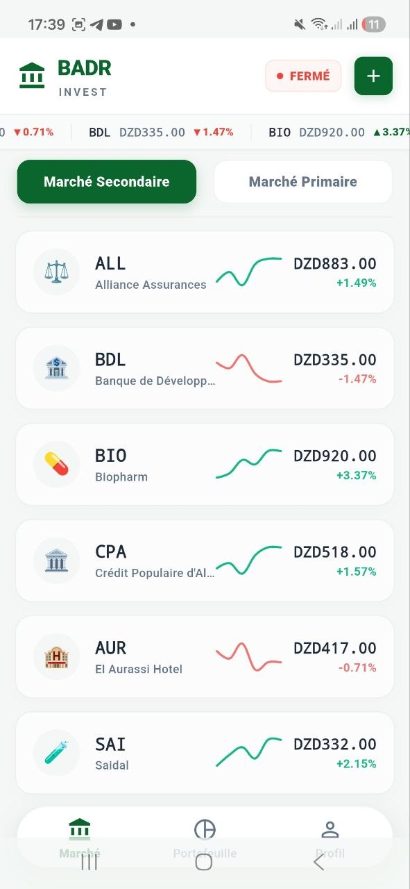
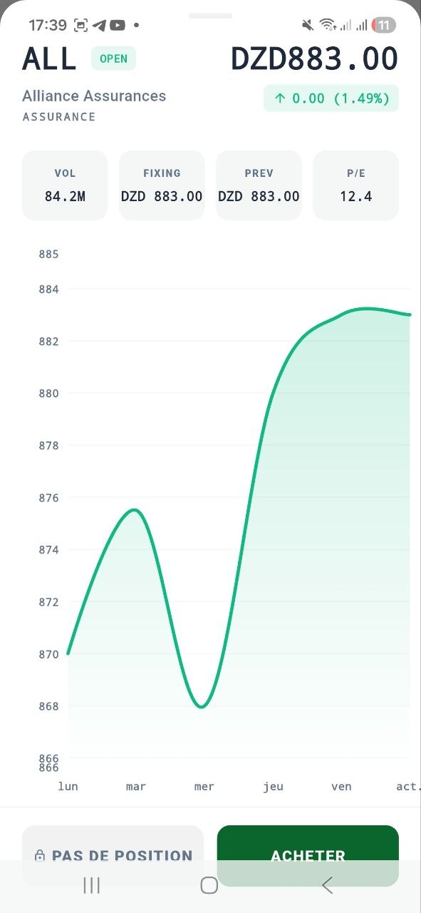
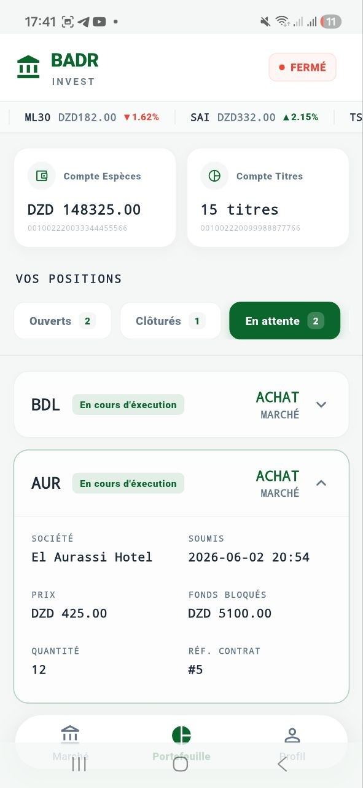
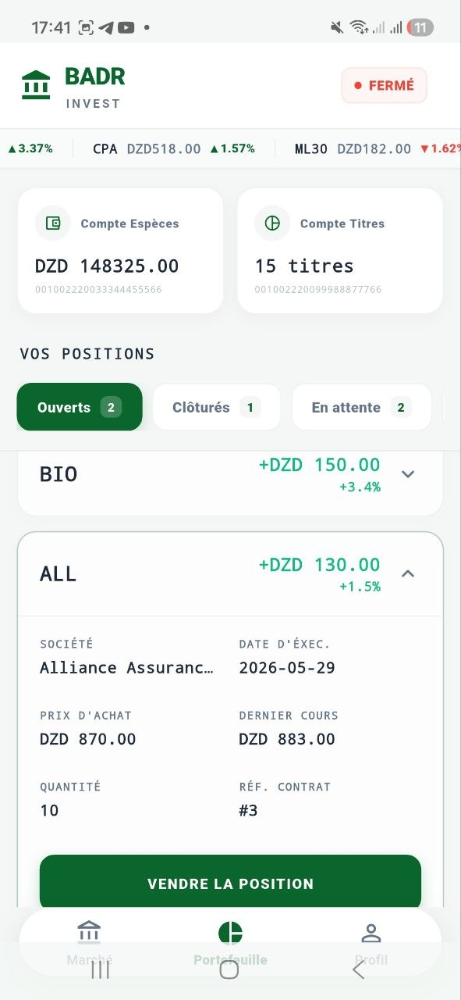
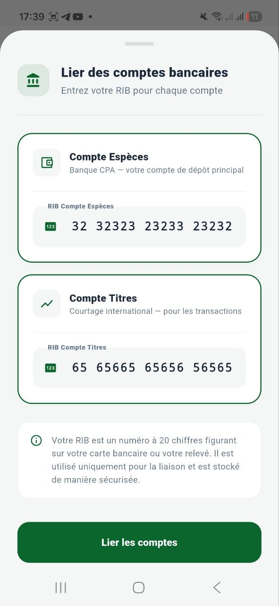
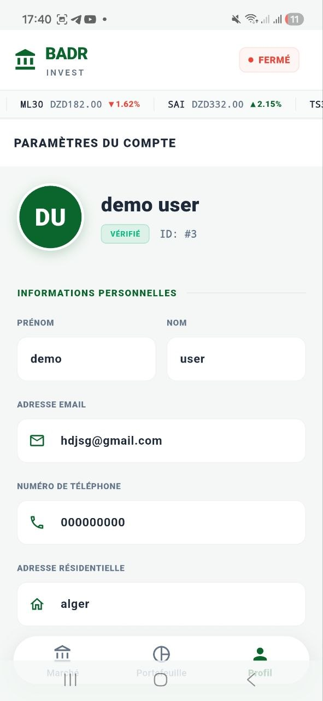
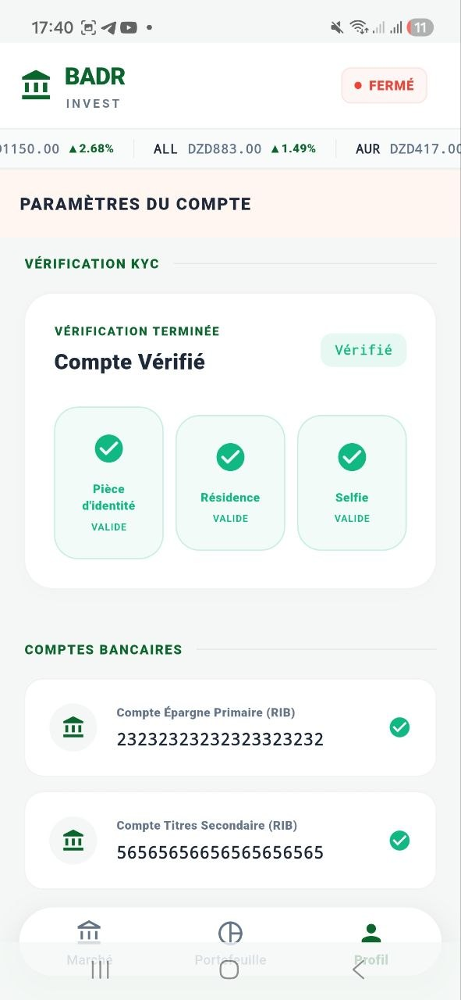

# BADR Invest

> Mobile brokerage platform prototype designed for the Algerian stock market.

  

BADR Invest is a mobile-first brokerage platform that simulates the workflow of a modern stock brokerage system.

The project was developed as a complete software engineering case study covering requirements engineering, UML modeling, database design, system architecture, and Android application development.

---

## Project Overview

Traditional brokerage systems often rely on manual verification procedures, physical interactions, and fragmented processes.

BADR Invest aims to digitalize the investor journey by providing:

- Investor onboarding
- KYC verification workflow
- Bank account linking
- Portfolio management
- Buy/Sell order management
- Market consultation
- User profile management

---

## Highlights

- Designed and developed independently
- Complete requirements engineering documentation
- UML modeling (Use Case, Class, Sequence Diagrams)
- Relational database design using SQLite
- Layered system architecture
- Android mobile application implementation
- Object-Oriented Design principles
- Design Pattern implementation (Singleton)

---

## Technology Stack

### Mobile Development
- Java
- Android SDK

### Database
- SQLite

### Software Engineering
- UML
- OOP
- Design Patterns
- Requirements Engineering
- Database Modeling
- System Architecture

---

## Screenshots

### Authentication & Onboarding

  

---

### Market & Analysis

  
  

---

### Portfolio Management

  
  

---

### Compliance & Verification

  
  

---

### User Profile

  
  

---

## System Architecture

The platform follows a three-layer architecture:

### Presentation Layer
- Android Activities
- User Interfaces

### Business Layer
- Controllers
- Services
- Validation Modules

### Data Layer
- Embedded SQLite Database

The application uses local storage because it is intended to simulate a real brokerage environment. Direct integration with banking infrastructure is outside the scope of the project due to security, confidentiality, and regulatory constraints.

---

## Documentation

| Section | Description |
|----------|-------------|
| [Requirements](requirements/) | Functional requirements, non-functional requirements, and business rules |
| [UML Diagrams](uml/) | Use Case, Class, and Sequence diagrams |
| [Database Design](database/) | Logical data model and relational schema |
| [Architecture](architecture/) | Layered architecture and design decisions |
| [Poster](poster/) | Project presentation poster |
| [Screenshots](screenshots/) | User interface gallery |

---

## Software Engineering Artifacts

The project includes:

- Functional Requirements Specification
- Non-Functional Requirements Specification
- Business Rules Definition
- UML Modeling
- Relational Database Design
- System Architecture Documentation
- Android Application Prototype

---

## Future Improvements

- Integration with external market data providers
- Real-time notifications
- Advanced portfolio analytics
- Backend API implementation
- Secure cloud synchronization

---

## Author

Badr

Computer Science Student

Areas of Interest:
- Software Engineering
- System Analysis & Design
- Mobile Development
- Fintech Systems
- Database Design

