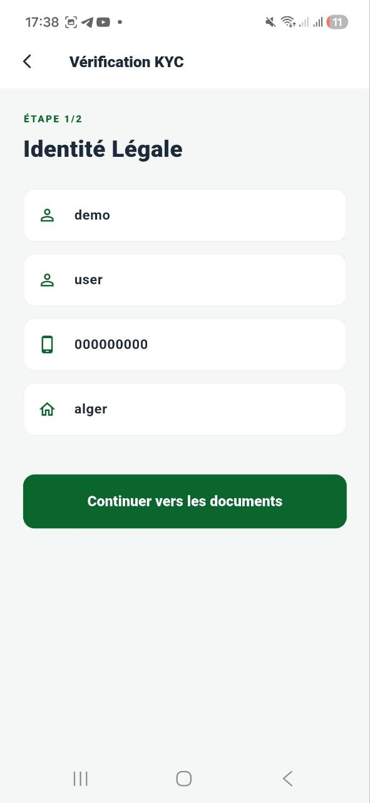
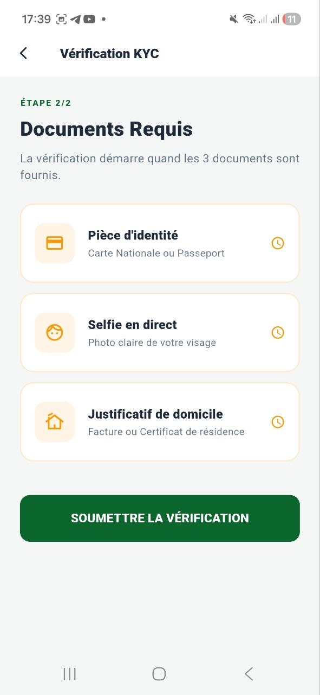

# Screenshots

Below are key interfaces of the BADR Invest platform.

---

## Authentication & Onboarding

  

---

## Market & Trading Interface

  
  

---

## Portfolio Management

  
  

---

## Compliance (KYC)

  
  

---

## Bank Linking

  

---

## User Profile

  
  

