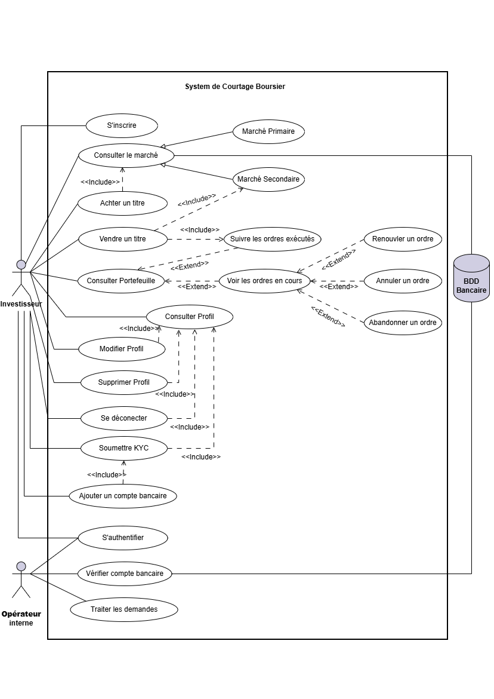
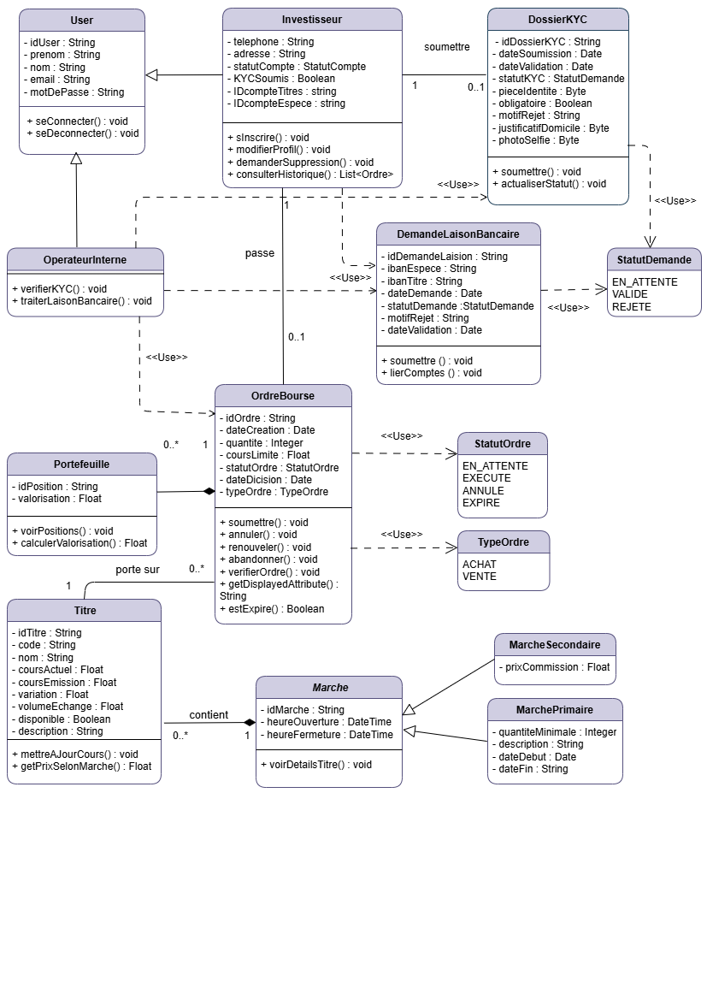
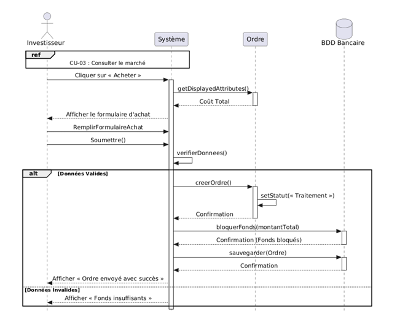
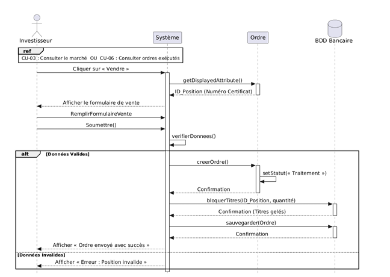

# UML Diagrams - BADR Invest

This section contains all UML diagrams used to design and model the BADR Invest platform.

These diagrams represent the system from different perspectives: functional, structural, and behavioral.

---

## 1. Use Case Diagram

### Description
This diagram defines the main actors and interactions with the system.

### Actors
- Investor
- Admin
- Bank System

### Main Use Cases
- User registration and authentication
- KYC verification process
- Bank account linking
- Market consultation
- Buying and selling financial assets
- Portfolio management

---

## 2. Class Diagram

### Description
This diagram represents the system structure using object-oriented principles.

### Main Classes
- User (abstract class)
  - Client
  - Admin
- KYC
- BankAccount
- Order
- Portfolio

### Design Concepts Used
- Inheritance (User → Client/Admin)
- Encapsulation
- Object relationships
- Singleton pattern (used in KYC and Bank linking services)

---

## 3. Sequence Diagram - Market Consultation

### Description
Represents the flow when a user consults market data.

### Flow
1. User requests market data
2. System queries database / API
3. Data is processed
4. Results returned to user interface

---

## 4. Sequence Diagram - Buy Order

### Description
Shows the process of buying a financial asset.

### Flow
1. User selects asset
2. System verifies account & KYC status
3. Order is validated
4. Transaction is executed
5. Portfolio is updated

---

## 5. Sequence Diagram - Sell Order

### Description
Represents the selling process of a financial asset.

### Flow
1. User selects asset to sell
2. System checks holdings
3. Order is validated
4. Transaction is executed
5. Portfolio is updated

---

## Summary

These UML diagrams represent the full system design lifecycle of the BADR Invest platform:
from user interaction → system behavior → internal structure.

They demonstrate strong skills in:
- Requirements analysis
- System modeling
- Object-oriented design
- Software architecture thinking
